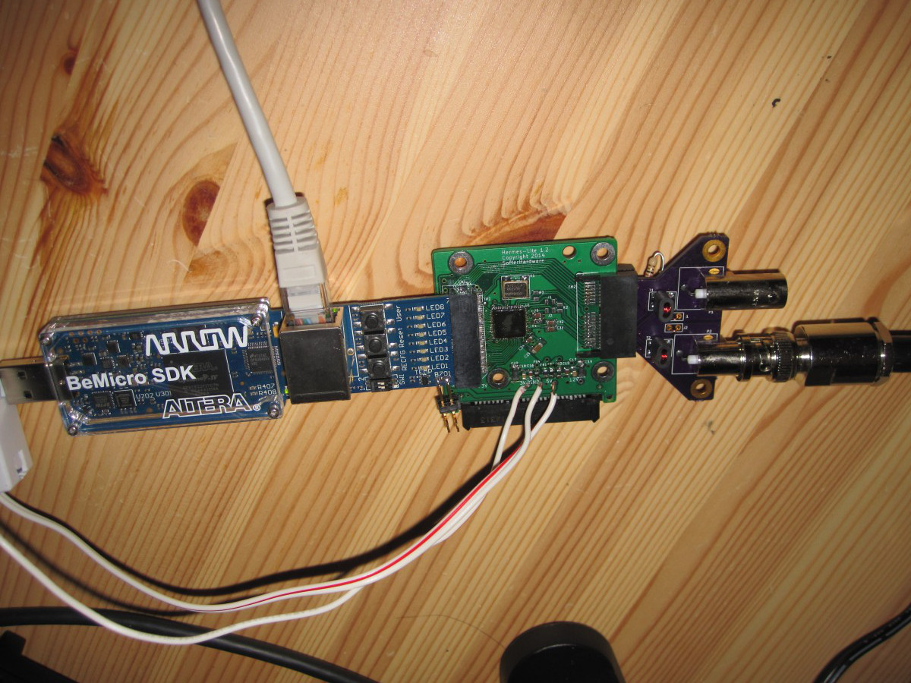
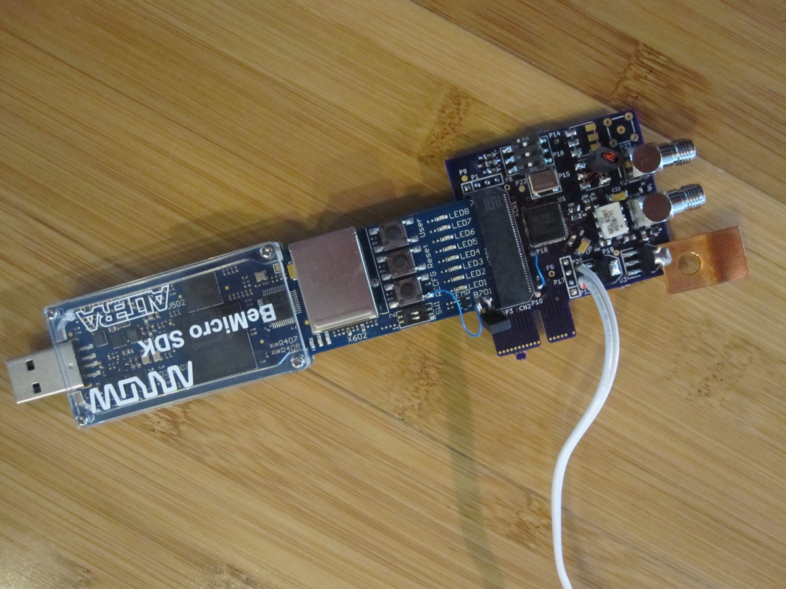
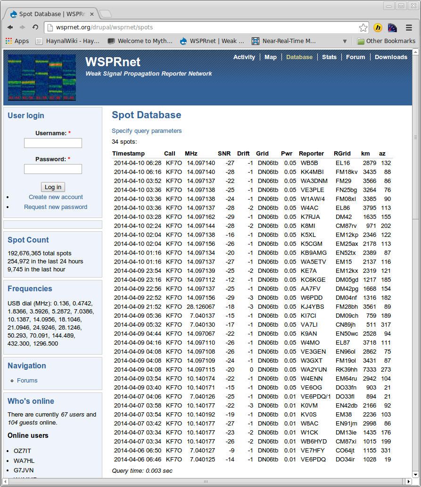

Hermes-Lite
===========

## Quick Links

 * [Google Groups](https://groups.google.com/forum/#!forum/hermes-lite) discussion forum.
 * [Hardware](https://github.com/softerhardware/Hermes-Lite/blob/master/pcb/README.md)
  * Hermes-Lite [schematic](https://github.com/softerhardware/Hermes-Lite/blob/master/pcb/hermeslite.pdf), [BOM](https://github.com/softerhardware/Hermes-Lite/blob/master/pcb/bom.xls) and [PCB](https://oshpark.com/shared_projects/WHfDeB2c).
  * Basic RF front end [schematic](https://github.com/softerhardware/Hermes-Lite/blob/master/frontend/basic/frontend.pdf), [BOM](https://github.com/softerhardware/Hermes-Lite/blob/master/frontend/basic/bom.xls) and [PCB](https://oshpark.com/shared_projects/K5UywZWT).
 * [RTL](https://github.com/softerhardware/Hermes-Lite/tree/master/rtl/README.md)

## Introduction

This is a work in progress to create a low-cost software defined radio HF transceiver. The hardware is based on Analog Devices' [AD9866](http://www.analog.com/en/broadband-products/broadband-codecs/ad9866/products/product.html) which is a 12-bit broadband modem mixed signal front end that has been repurposed as a direct down conversion and direct up conversion SDR transceiver covering 0-36 MHz. A hardware prototype has been built and tested that uses a [BeMicro SDR](http://www.arrownac.com/solutions/bemicro-sdk/) FPGA board for DSP processing. The FPGA firmware is a port of the [Hermes SDR](http://openhpsdr.org/wiki/index.php?title=HERMES) project. The ported firmware preserves enough compatibility with the original Hermes SDR so that existing Hermes front-end software may be used with the Hermes-Lite without modification. Initial receive and transmit tests show good performance and appear later in this README. All software and hardware intellectual property is open source. Contributions and derivatives are encouraged. Please refer to the development section in this README. 

Thank you to N9VV for posting [screencast1](http://www.screencast.com/t/HGJk74dE) and [screencast2](http://www.screencast.com/t/Q3MsL02y).

A development discussion forum is on [Google Groups](https://groups.google.com/forum/#!forum/hermes-lite). 

The original Hermes-Lite project is [here](https://github.com/softerhardware/Hermes-Lite/edit/master/README.md).

#### Project Goals
 * 0-30MHz (HF) transceiver with decent performance
 * Entirely open source and open hardware design
 * Cost of less than $150 (cost includes FPGA board) for hobbyist who build their own
 * Maintain enough compatibility with Hermes to use existing Hermes SDR front-end software with no or minor modification

#### Hermes-Lite v1.2

#### Hermes-Lite v0.9

## Development

Discussion regarding development takes place on the [Hermes-Lite Google Group](https://groups.google.com/forum/#!forum/hermes-lite). Bugs and future enhancments are captured in the [github issues](https://github.com/softerhardware/Hermes-Lite/issues). Also, refer to the README files in the fpga and pcb subdirectories.

If you are interested in helping with development, please fork this project on github. Once you think you have significant contributions, issue a pull request. I will review your changes and may include them in this repository. Also, I am happy to see other forks of this project gain traction and possibly become the "main" repository. More power to you if you build a better Hermes-Lite! I do not plan to have a single central repository with multiple committers. 

## Receive Experiments

I compared the Hermes-Lite with a Hermes and a [SoftRock RXTX Ensemble Transceiver](http://fivedash.com/) at spotting JT65 and JT9 transmissions with [WSJT-X](http://www.physics.princeton.edu/pulsar/K1JT/wsjtx.html) software running on Linux. I connected two radios to the same antenna right at a tee so there is no additional coax for either radio. I adjusted the radios so that common spots are within a few Hz. This ensures that one radio is not spotting signals that are out of band for the other. I adjusted audio levels to be similar for both copies of WSJT-X that I am running. WSJT-X is not very sensitive to different input levels anyway. The Hermes and Hermes-Lite were both using [ghpsdr-alex](http://napan.ca/ghpsdr3/index.php/Main_Page) software running on separate computers, and the RXTX was using [Quisk](http://james.ahlstrom.name/quisk/). The Hermes has a 4-1 impedance transformer. The Hermes-Lite has a 9-1 impedance transformer to better match the 400 Ohm input of the AD9866. This explains some differences in the data. The Hermes was run with no attenuation and hence has 20 dB gain from the LTC6400-20. The Hermes-Lite was also run with integrated gain set to ~20 dB unless noted otherwise. Finally, I let everything run for several hours to get a large sample set. 

### JT65 and JT9 Spot Data

| Band | 30M | 30M | 30M | 10M | 10M | 10M | 10M | 10M |
|:---- | ---:| ---:| ---:| ---:| ---:| ---:| ---:| ---:|
| Total Spots | 1629  |  676  |  826  |  2421  |  1488  |  1934  |  2461  |  570  |
| Common Spots | 1448 (88.9%)  |  647 (95.7%)  |  792 (95.9%)  |  1680 (69.4%)  |  778 (52.3%)  |  1420 (73.4%)  |  1663 (67.6%)  |  414 (72.6%)  |
| Lite Unique Spots |  |  22 (3.3%)  |  24 (2.9%)  |  |  699 (47.0%)  |  493 (25.5%)  |  768 (31.2%)  |  39 (6.8%)  |
| Hermes Unique Spots |  103 (6.3%)  |  7 (1.0%)  |  10 (1.2%)  |  342 (14.1%)  | |  21 (1.1%)  |  30 (1.2%)  |  117 (20.5%)  |
| RXTX Unique Spots |   78 (4.8%)  | | |  399 (16.5%)  |  11 (0.7%)  | | | |
| Lite Gain dB | | 20  | 28  | | 28  | 20  | 28  | 12  |
| Lite Common SNR Average dB |  |  -8.1   |  -7.7   | | -4.7 |  -9.0  |  -9.1   |  -12.8   |
| Hermes Common SNR Average dB | -7.3   |  -8.0   |  -7.7   |  -6.1   | |  -9.8   |  -10.2   |  -9.6   |
| RXTX Common SNR Average dB |  -7.5   | | |  -10.0   |  -12.6   |  | |  |
| Lite Unique SNR Average dB | |  -11.9   |  -11.5   |  |  -17.3   |  -16.2   |  -14.8   |  -15.5   |
| Hermes Unique SNR Average dB |  -15.3   |  -13.3   |  -20.4   |  -16.9   | |  -16.0   |  -14.2   |  -18.5   |
| RXTX Unique SNR Average dB |  -8.6   | | |  -11.9   |  -12.0   | | | |

The results from the Hermes-Lite compare well with the Hermes and the RXTX. You can see that on 30M all radios were about the same, maybe with a slight edge to the Hermes-Lite on unique spot count. The more interesting data is on 10M. Here there was a clear advantage to the Hermes-Lite in terms of unique spots and SNR (average SNR of all common spots) when the Hermes-Lite was run at 20 dB gain (to match the fixed gain of the Hermes but not accounting for the different input transformers) or 28 dB. When the Hermes-Lite was run with only 12 dB gain, the Hermes did better. This suggests that the Hermes might benefit from additional gain on the higher frequencies.  

When one radio has a unique spot that the other misses, it is not because the other radio missed all spots within that minute. Rather, I see that one radio spots n and the other n-1. The missed spot is not always the weakest signal. Sometimes it is a fairly strong signal. More often the missed spot is a JT9 signal, which has a narrower bandwidth and more stringent demands.

I did not experience problems with exceeding the lower dynamic range of the Hermes-Lite. This may be due in part to my relatively poor antenna setup and rural town location. All experiments were with a ~7M vertical with base at ~2M above ground with a wire grape trellis as a ground plane. The vertical was tuned with a Z-match at the base. Also, the integrated gain in the Hermes-Lite with control in 1 dB steps from -12 dB to +48 dB appears useful to extend the dynamic range. There is a fast path to adjust this gain so that an AGC may be implemented.

These experiments only test a receiver's performance at decoding JT65 and JT9 in the real world, and other proper receiver measurments should be run, but I think they are somewhat indicative of a receiver's performance in general. Even though a less expensive ADC and clock source were used when compared to the Hermes, I did not see any dramatic penalty in reception of JT65 and JT9 spots. Instead, I saw cases where the Hermes-Lite performed better. 

## Transmit Experiments

I tested transmit with [WSPR](http://www.physics.princeton.edu/pulsar/K1JT/wspr.html) and observed spots of my signal on [WSPRnet](http://wsprnet.org/). [PowerSDR](http://openhpsdr.org/wiki/index.php?title=PowerSDR) running under Windows was used to test transmit. At first, I had only 10 dBm (10 mW) output as I had not adjusted the transmit interpolation filter for the new sampling frequency. After adjusting the interpolation filter, I had 17 dBm (50 mW) output. I am using the IAMP on the AD9866 which will do 20 dBm (100 mW) and even 23 dBm (200 mW) with some distortion. I am targeting 20 dBm (100 mW) but need to get a large ferrite core to accomodate the correct turns ratio. The unique WSPR spots appear below. This is just an indicator that transmit is working and proper transmit measurments still must be made. 

